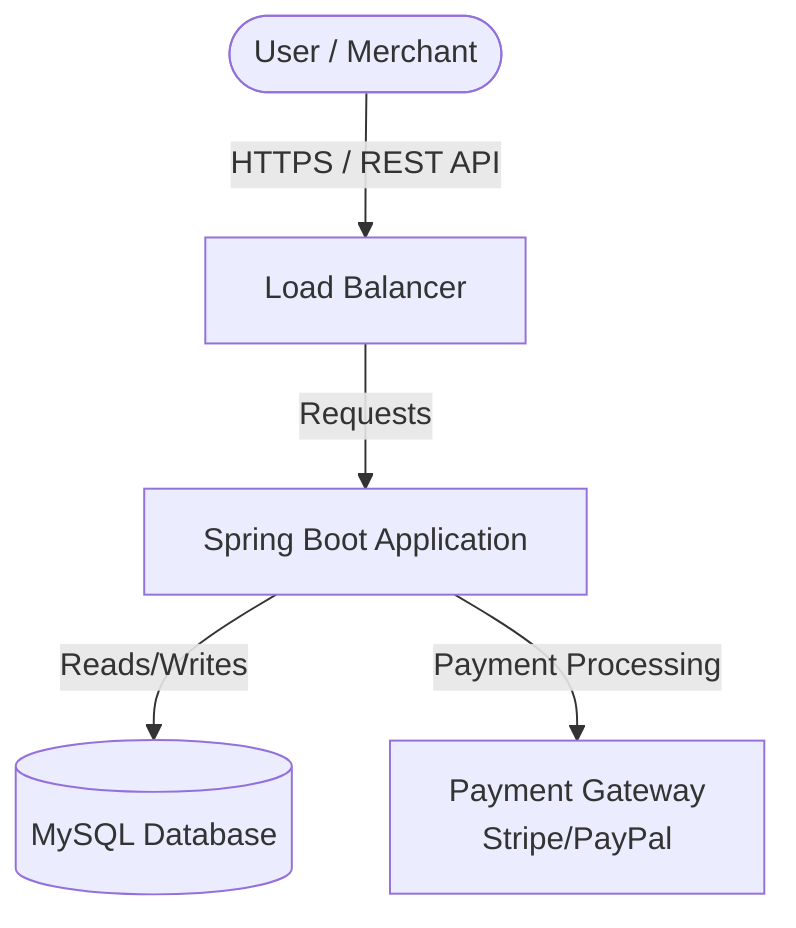
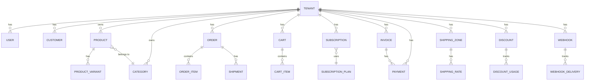

# Project Documentation Index

This document serves as the entry point for the architectural and functional documentation of the SaaS E-Commerce Platform.

## 🏗️ Architecture Overview

The system follows a **Modular Monolith** architecture built with Spring Boot. Each business domain is encapsulated in its own package (module).

### Core Architecture Documents

| Document | Description |
| :--- | :--- |
| [Multi-Tenancy Architecture](MULTI_TENANCY.md) | Complete guide to tenant isolation, data boundaries, and security |
| [Common Module](src/main/java/com/firas/saas/common/README.md) | Base entities, TenantContext, and shared utilities |

### High-Level Modules

| Module | Description | Documentation Link |
| :--- | :--- | :--- |
| **Tenant** | Manages merchant onboarding and isolation. | [Tenant Module](src/main/java/com/firas/saas/tenant/README.md) |
| **Security** | Handles Authentication & Authorization (JWT). | [Security Module](src/main/java/com/firas/saas/security/README.md) |
| **User** | Manages User accounts (Merchant, Staff, Customer). | [User Module](src/main/java/com/firas/saas/user/README.md) |
| **Product** | Catalog management (Products, Categories, Variants). | [Product Module](src/main/java/com/firas/saas/product/README.md) |
| **Subscription** | Dynamic plans and billing strategy. | [Subscription Module](src/main/java/com/firas/saas/subscription/README.md) |
| **Billing** | Invoice and payment management. | [Billing Module](src/main/java/com/firas/saas/billing/README.md) |
| **Order** | Order processing and status management. | [Order Module](src/main/java/com/firas/saas/order/README.md) |
| **Customer** | CRM data for store customers. | [Customer Module](src/main/java/com/firas/saas/customer/README.md) |
| **Shipping** | Zones, rates, and shipment tracking. | [Shipping Module](src/main/java/com/firas/saas/shipping/README.md) |
| **Discount** | Coupon codes and promotional discounts. | [Discount Module](src/main/java/com/firas/saas/discount/README.md) |
| **Analytics** | Dashboard stats and sales reports. | [Analytics Module](src/main/java/com/firas/saas/analytics/README.md) |
| **Webhook** | External integrations and event notifications. | [Webhook Module](src/main/java/com/firas/saas/webhook/README.md) |
| **App Platform** | Third-party app registration, installation, scoped tokens. | [App Platform Module](src/main/java/com/firas/saas/app/README.md) |

## 🎯 Design Patterns Used

| Pattern | Implementation | Purpose |
| :--- | :--- | :--- |
| **Observer Pattern** | `DomainEventPublisher` + `WebhookEventListener` | Decoupled event handling for webhooks |
| **Strategy Pattern** | `PaymentStrategy` interface | Pluggable payment providers |
| **Repository Pattern** | All `*Repository` classes | Data access abstraction |
| **DTO Pattern** | `*Request`, `*Response` classes | API boundary separation |

## 🧩 System Context Diagram

## 🔐 Database Schema

### Tenant Scoping Summary

| Entity | Tenant-Scoped | Notes |
|--------|---------------|-------|
| Tenant | N/A | IS the tenant |
| User | ✅ | ManyToOne relationship |
| Customer | ✅ | Extends TenantEntity |
| Product | ✅ | Extends TenantEntity |
| Category | ✅ | Extends TenantEntity |
| ProductVariant | ✅ | Extends TenantEntity |
| Order | ✅ | Extends TenantEntity |
| Cart | ✅ | Extends TenantEntity |
| Subscription | ✅ | Extends TenantEntity |
| Invoice | ✅ | Extends TenantEntity |
| Payment | ✅ | Extends TenantEntity |
| ShippingZone | ✅ | Extends TenantEntity |
| ShippingRate | ✅ | Extends TenantEntity |
| Shipment | ✅ | Extends TenantEntity |
| Discount | ✅ | Extends TenantEntity |
| DiscountUsage | ✅ | Extends TenantEntity |
| Webhook | ✅ | Extends TenantEntity |
| WebhookDelivery | ✅ | Extends TenantEntity |
| App | ❌ | Global (platform-wide apps) |
| AppInstallation | ✅ | Extends TenantEntity |
| AppAccessToken | ✅ | Extends TenantEntity |
| SubscriptionPlan | ❌ | Global (shared across tenants) |

## 📚 How to Navigate
Click on the **Documentation Link** for each module above to view detailed schemas, internal flows, and API descriptions.

## 📝 Last Updated

- **Date**: January 21, 2026
- **Changes**: Added App Platform module, Observer Pattern for webhooks

