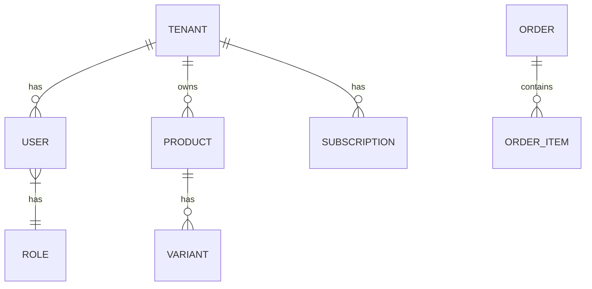

# Project Documentation Index

This document serves as the entry point for the architectural and functional documentation of the SaaS E-Commerce Platform.

## 🏗️ Architecture Overview

The system follows a **Modular Monolith** architecture built with Spring Boot. Each business domain is encapsulated in its own package (module).

### High-Level Modules

| Module | Description | Documentation Link |
| :--- | :--- | :--- |
| **Tenant** | Manages merchant onboarding and isolation. | [Tenant Module](src/main/java/com/firas/saas/tenant/README.md) |
| **Security** | Handles Authentication & Authorization (JWT). | [Security Module](src/main/java/com/firas/saas/security/README.md) |
| **User** | Manages User accounts (Merchant, Staff, Customer). | [User Module](src/main/java/com/firas/saas/user/README.md) |
| **Product** | Catalog management (Products, Categories, Variants). | [Product Module](src/main/java/com/firas/saas/product/README.md) |
| **Subscription** | Dynamic plans and billing strategy. | [Subscription Module](src/main/java/com/firas/saas/subscription/README.md) |
| **Order** | Order processing and status management. | [Order Module](src/main/java/com/firas/saas/order/README.md) |
| **Customer** | CRM data for store customers. | [Customer Module](src/main/java/com/firas/saas/customer/README.md) |

## 🧩 System Context Diagram

## 🔐 Database Schema (Simplified)

## 📚 How to Navigate
Click on the **Documentation Link** for each module above to view detailed schemas, internal flows, and API descriptions.
