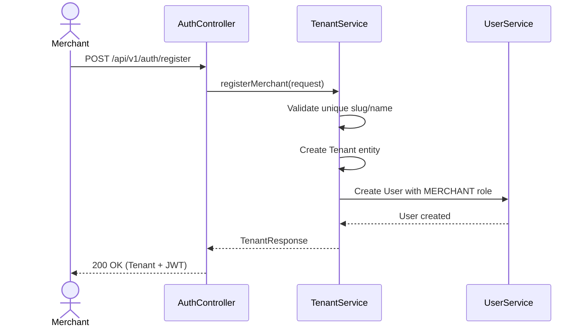
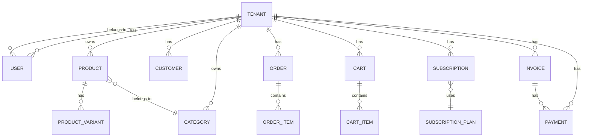

# Multi-Tenancy Architecture

This document explains the core multi-tenancy design of the Shopify-alternative e-commerce SaaS platform.

## 📋 Table of Contents

1. [Tenant Definition & Role](#1-tenant-definition--role)
2. [Terminology Clarification](#2-terminology-clarification)
3. [Tenant as Root Aggregate](#3-tenant-as-root-aggregate)
4. [Module-by-Module Tenant Dependency](#4-module-by-module-tenant-dependency)
5. [Security & Isolation Strategy](#5-security--isolation-strategy)
6. [Using TenantContext](#6-using-tenantcontext)
7. [Global vs Tenant-Scoped Data](#7-global-vs-tenant-scoped-data)

---

## 1. Tenant Definition & Role

### What is a Tenant?

A **Tenant** represents a **Merchant's Store** in this Shopify-like SaaS platform. Each tenant is an independent e-commerce store created by a merchant during onboarding.

### Role of the Tenant Model

The `Tenant` entity exists to:

1. **Establish Data Boundaries** - All business entities (Products, Orders, Customers, etc.) are scoped to a tenant
2. **Enable Multi-tenancy** - Complete data isolation between stores
3. **Support Subscription Billing** - Subscriptions are linked to tenants, not individual users
4. **Define Ownership** - The `ownerEmail` identifies the primary merchant

### Tenant Entity

```java
@Entity
@Table(name = "tenants")
public class Tenant extends BaseEntity {
    private String name;        // Store display name
    private String slug;        // Unique URL identifier (e.g., "my-store")
    private String ownerEmail;  // Primary merchant email
    private boolean active;     // Store status
}
```

### Tenant Lifecycle



---

## 2. Terminology Clarification

| Term | Definition | Database Representation |
|------|------------|------------------------|
| **Tenant** | The root aggregate representing a Store | `tenants` table |
| **Merchant** | The business owner who creates and manages a Store | `users` table with `role=MERCHANT` |
| **Store** | Synonym for Tenant - the e-commerce storefront | Same as Tenant |
| **User** | Accounts that access the merchant dashboard | `users` table (MERCHANT, STAFF, ADMIN) |
| **Customer** | End-users who shop at a specific store | `customers` table (tenant-scoped) |

### Relationships

```
Tenant (Store)
├── Users (Merchant, Staff)
├── Customers (Shoppers)
├── Products
│   ├── Categories
│   └── Variants
├── Orders
│   └── OrderItems
├── Carts
│   └── CartItems
├── Subscriptions
├── Invoices
└── Payments
```

---

## 3. Tenant as Root Aggregate

### Base Entity Hierarchy

```
BaseEntity (id, createdAt, updatedAt)
├── Tenant
├── User (has ManyToOne → Tenant)
├── SubscriptionPlan (GLOBAL - no tenant)
└── TenantEntity (extends BaseEntity, adds tenantId)
    ├── Product
    ├── Category
    ├── ProductVariant
    ├── Customer
    ├── Order
    ├── OrderItem
    ├── Cart
    ├── CartItem
    ├── Subscription
    ├── Invoice
    └── Payment
```

### TenantEntity Base Class

```java
@MappedSuperclass
public abstract class TenantEntity extends BaseEntity {
    
    @Column(name = "tenant_id", nullable = false)
    private Long tenantId;
}
```

This ensures:
- `tenant_id` is **NOT NULL** at the database level
- All extending entities automatically inherit tenant isolation

---

## 4. Module-by-Module Tenant Dependency

| Module | Entity | Has tenant_id? | Mandatory? | Isolation Method |
|--------|--------|----------------|------------|------------------|
| **Tenant** | `Tenant` | N/A (IS tenant) | N/A | Root entity |
| **User** | `User` | ✅ (JPA FK) | ✅ `nullable=false` | `@ManyToOne Tenant` |
| **Customer** | `Customer` | ✅ | ✅ | Extends `TenantEntity` |
| **Product** | `Product` | ✅ | ✅ | Extends `TenantEntity` |
| **Product** | `Category` | ✅ | ✅ | Extends `TenantEntity` |
| **Product** | `ProductVariant` | ✅ | ✅ | Extends `TenantEntity` |
| **Order** | `Order` | ✅ | ✅ | Extends `TenantEntity` |
| **Order** | `OrderItem` | ✅ | ✅ | Extends `TenantEntity` |
| **Order** | `Cart` | ✅ | ✅ | Extends `TenantEntity` |
| **Order** | `CartItem` | ✅ | ✅ | Extends `TenantEntity` |
| **Subscription** | `Subscription` | ✅ | ✅ | Extends `TenantEntity` |
| **Subscription** | `SubscriptionPlan` | ❌ | N/A | **GLOBAL** (shared) |
| **Billing** | `Invoice` | ✅ | ✅ | Extends `TenantEntity` |
| **Billing** | `Payment` | ✅ | ✅ | Extends `TenantEntity` |

---

## 5. Security & Isolation Strategy

### Authentication Level

JWT-based stateless authentication with tenant context:

```java
public class UserPrincipal implements UserDetails {
    private final Long id;
    private final String email;
    private final Long tenantId;  // ✅ Tenant ID in security context
    private final Collection<? extends GrantedAuthority> authorities;
    
    public UserPrincipal(User user) {
        this.tenantId = user.getTenant().getId();
        // ...
    }
}
```

### Authorization Level

Role-based access control with roles:
- `MERCHANT` - Store owner
- `STAFF` - Store employee
- `CUSTOMER` - Shopper
- `ADMIN` - Platform administrator

### Repository Level Isolation

All repositories enforce tenant filtering:

```java
@Repository
public interface ProductRepository extends BaseRepository<Product> {
    List<Product> findAllByTenantId(Long tenantId);
    Optional<Product> findBySlugAndTenantId(String slug, Long tenantId);
    boolean existsBySlugAndTenantId(String slug, Long tenantId);
}
```

### Service Level Validation

Double-check validation in services:

```java
@Service
public class ProductServiceImpl implements ProductService {
    
    @Override
    public ProductResponse createProduct(ProductRequest request, Long tenantId) {
        // Validate category belongs to tenant
        if (!category.getTenantId().equals(tenantId)) {
            throw new RuntimeException("Category does not belong to this tenant");
        }
        // ...
    }
}
```

### Cross-Tenant Access Prevention

A user from **Tenant A** cannot access **Tenant B's** data because:

1. `UserPrincipal.tenantId` is embedded in the JWT
2. All service methods receive `tenantId` as a parameter
3. All repository queries filter by `tenantId`
4. Service-level validation rejects cross-tenant entity access

---

## 6. Using TenantContext

### TenantContext Utility

The `TenantContext` utility class provides easy access to the current tenant:

```java
// Get current tenant ID (throws if not authenticated)
Long tenantId = TenantContext.getCurrentTenantId();

// Get tenant ID or null (safe for optional operations)
Long tenantId = TenantContext.getCurrentTenantIdOrNull();

// Check if tenant context exists
if (TenantContext.hasTenantContext()) {
    // Tenant-aware operation
}
```

### Location

```
src/main/java/com/firas/saas/common/context/TenantContext.java
```

### Usage in Controllers

```java
@RestController
@RequestMapping("/api/v1/products")
public class ProductController {
    
    @GetMapping
    public ResponseEntity<List<ProductResponse>> getProducts() {
        Long tenantId = TenantContext.getCurrentTenantId();
        return ResponseEntity.ok(productService.getAllProducts(tenantId));
    }
}
```

---

## 7. Global vs Tenant-Scoped Data

### Global Data (NOT Tenant-Scoped)

| Entity | Reason |
|--------|--------|
| `SubscriptionPlan` | Shared plan definitions (Basic, Pro, Enterprise) |
| `Role` | Enum, not a database entity |

### Tenant-Scoped Data

Everything else is tenant-scoped:
- Products, Categories, Variants
- Customers
- Orders, Carts
- Subscriptions (per-tenant subscription instances)
- Invoices, Payments

---

## 📊 Database Schema



---

## ✅ Architecture Checklist

When adding new modules, ensure:

- [ ] Entity extends `TenantEntity` (if tenant-scoped)
- [ ] Repository has `findByTenantId()` methods
- [ ] Service receives `tenantId` parameter
- [ ] Controller uses `TenantContext.getCurrentTenantId()`
- [ ] Cross-tenant access is validated in service layer

---

## 📝 Last Updated

- **Date**: January 20, 2026
- **Author**: Architecture Team

