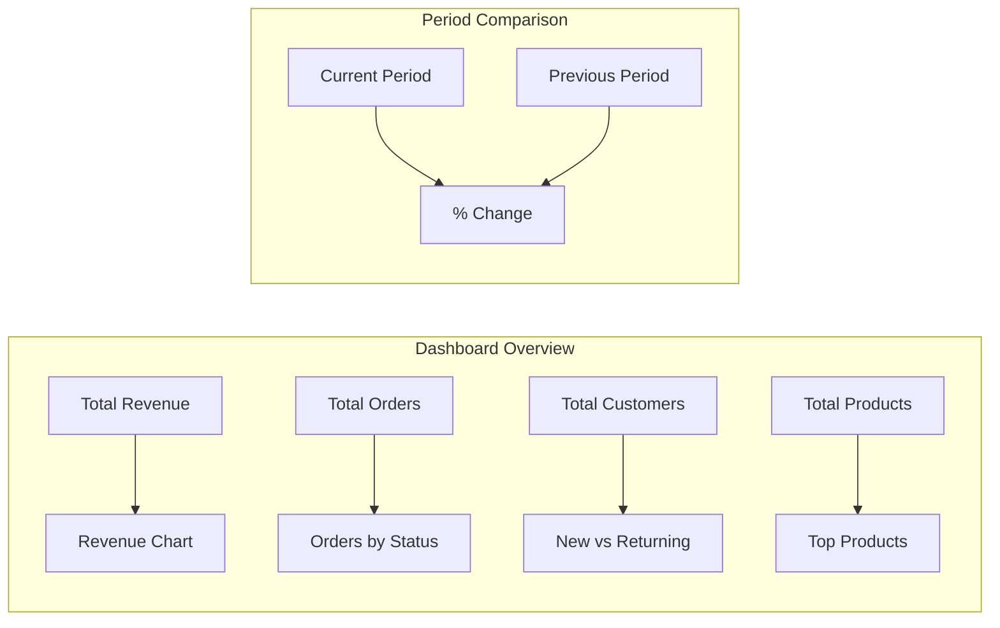
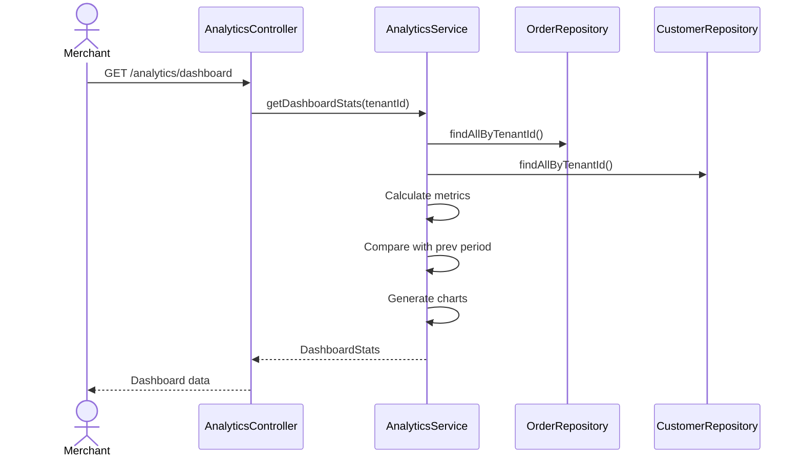

# Analytics Module Documentation

## 📝 Overview

The Analytics module provides dashboard statistics, sales reports, and customer analytics for merchants. All analytics are scoped to the tenant and computed from existing order and customer data.

## 📁 Package Structure

```
com.firas.saas.analytics/
├── dto/
│   ├── DashboardStats.java      # Dashboard overview data
│   ├── SalesReport.java         # Sales breakdown report
│   └── CustomerAnalytics.java   # Customer insights
├── service/
│   ├── AnalyticsService.java
│   └── AnalyticsServiceImpl.java
├── controller/
│   └── AnalyticsController.java
└── README.md
```

## 🔑 Key DTOs

### DashboardStats

Main dashboard overview with key metrics.

```java
public class DashboardStats {
    private BigDecimal totalRevenue;
    private Long totalOrders;
    private Long totalCustomers;
    private Long totalProducts;
    private BigDecimal revenueChange;       // % change from prev period
    private List<TopProduct> topProducts;
    private List<RecentOrder> recentOrders;
    private List<DailyRevenue> revenueChart;
    private Map<String, Long> ordersByStatus;
}
```

### SalesReport

Detailed sales breakdown by period, category, and product.

```java
public class SalesReport {
    private String periodStart;
    private String periodEnd;
    private BigDecimal totalRevenue;
    private Long totalOrders;
    private BigDecimal averageOrderValue;
    private Long totalItemsSold;
    private List<CategorySales> salesByCategory;
    private List<ProductSales> salesByProduct;
    private List<PeriodSales> salesByPeriod;
}
```

### CustomerAnalytics

Customer behavior and value insights.

```java
public class CustomerAnalytics {
    private Long totalCustomers;
    private Long newCustomersThisPeriod;
    private Long returningCustomers;
    private Double retentionRate;
    private BigDecimal averageCustomerValue;
    private List<TopCustomer> topCustomers;
    private List<CustomerGrowth> customerGrowth;
}
```

## 📊 Dashboard Metrics



## 🔄 Analytics Flow



## 📡 API Endpoints

| Method | Endpoint | Description |
|--------|----------|-------------|
| GET | `/api/v1/analytics/dashboard` | Dashboard stats (last 30 days) |
| GET | `/api/v1/analytics/dashboard/range?startDate=&endDate=` | Dashboard for date range |
| GET | `/api/v1/analytics/sales?startDate=&endDate=` | Sales report for range |
| GET | `/api/v1/analytics/customers` | Customer analytics (last 30 days) |
| GET | `/api/v1/analytics/customers/range?startDate=&endDate=` | Customer analytics for range |

## 💡 Usage Examples

### Get Dashboard Stats
```http
GET /api/v1/analytics/dashboard
Authorization: Bearer {{token}}
```

Response:
```json
{
  "totalRevenue": 15420.50,
  "totalOrders": 142,
  "totalCustomers": 89,
  "totalProducts": 45,
  "revenueChange": 12.5,
  "ordersByStatus": {
    "PENDING": 5,
    "PROCESSING": 12,
    "SHIPPED": 25,
    "DELIVERED": 95,
    "CANCELLED": 5
  },
  "recentOrders": [...],
  "revenueChart": [
    {"date": "2026-01-01", "revenue": 520.00, "orders": 5},
    {"date": "2026-01-02", "revenue": 680.00, "orders": 7}
  ]
}
```

### Get Sales Report
```http
GET /api/v1/analytics/sales?startDate=2026-01-01&endDate=2026-01-31
Authorization: Bearer {{token}}
```

### Get Customer Analytics
```http
GET /api/v1/analytics/customers
Authorization: Bearer {{token}}
```

Response:
```json
{
  "totalCustomers": 89,
  "newCustomersThisPeriod": 15,
  "returningCustomers": 34,
  "retentionRate": 38.2,
  "averageCustomerValue": 173.26,
  "topCustomers": [
    {"email": "vip@example.com", "totalSpent": 2500.00, "totalOrders": 12}
  ]
}
```

## 🔒 Tenant Isolation

- All analytics are computed from tenant-scoped data
- No entity required - analytics are derived from Order, Customer, Product data
- Controller uses `TenantContext.getCurrentTenantId()`

## 🚀 Future Enhancements

- [ ] Product performance analytics
- [ ] Conversion funnel analysis
- [ ] Real-time dashboard with WebSockets
- [ ] Export reports to PDF/CSV
- [ ] Scheduled email reports
- [ ] Predictive analytics

## 📝 Last Updated

- **Date**: January 20, 2026

