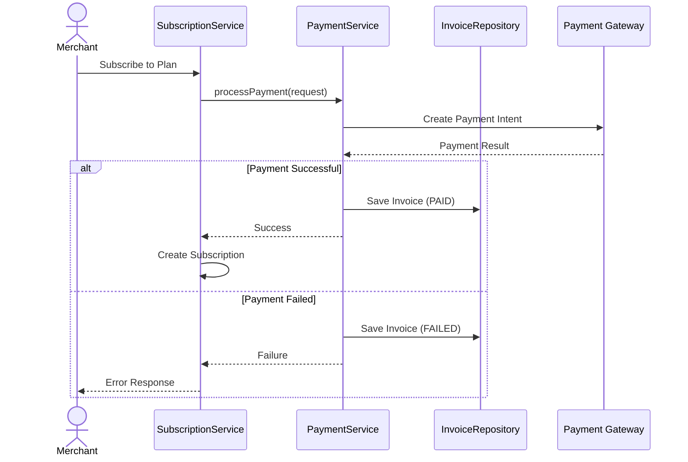
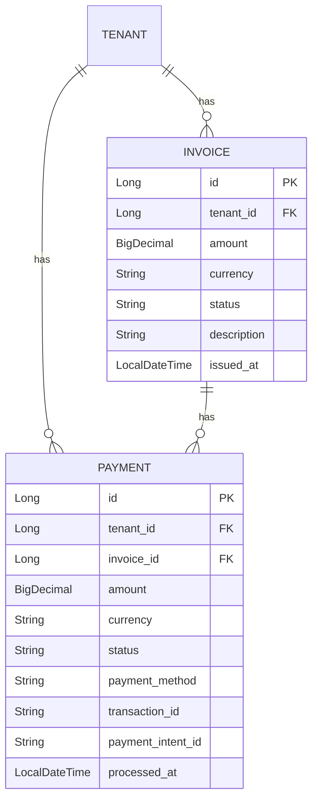

# Billing Module Documentation

## 📝 Overview

The Billing module handles invoice generation and payment processing for tenant subscriptions. All billing data is tenant-scoped.

## 📁 Package Structure

```
com.firas.saas.billing/
├── entity/
│   ├── Invoice.java          # Invoice records
│   └── Payment.java          # Payment transactions
├── repository/
│   ├── InvoiceRepository.java
│   └── PaymentRepository.java
├── dto/
│   ├── InvoiceRequest.java
│   ├── InvoiceResponse.java
│   ├── PaymentRequest.java
│   └── PaymentResponse.java
├── service/
│   ├── PaymentService.java
│   └── PaymentServiceImpl.java
└── controller/
    └── BillingController.java
```

## 🔑 Key Entities

### Invoice

Represents a billing invoice for a tenant's subscription.

```java
@Entity
@Table(name = "invoices")
public class Invoice extends TenantEntity {
    // tenantId inherited from TenantEntity
    
    private BigDecimal amount;
    private String currency;        // "USD", "EUR", etc.
    private String status;          // "PAID", "PENDING", "FAILED"
    private String description;
    private LocalDateTime issuedAt;
}
```

### Payment

Represents a payment transaction for an invoice.

```java
@Entity
@Table(name = "payments")
public class Payment extends TenantEntity {
    // tenantId inherited from TenantEntity
    
    private Long invoiceId;
    private BigDecimal amount;
    private String currency;
    private PaymentStatus status;       // PENDING, SUCCEEDED, FAILED, etc.
    private String paymentMethod;       // "CARD", "PAYPAL", etc.
    private String transactionId;       // External gateway transaction ID
    private String paymentIntentId;     // Stripe PaymentIntent or equivalent
    private String gatewayResponse;     // JSON from payment gateway
    private String failureReason;
    private LocalDateTime processedAt;
}
```

### PaymentStatus Enum

```java
public enum PaymentStatus {
    PENDING,
    PROCESSING,
    SUCCEEDED,
    FAILED,
    CANCELLED,
    REFUNDED,
    PARTIALLY_REFUNDED
}
```

## 🔄 Billing Flow



## 📊 Database Schema



## 🔒 Tenant Isolation

Both `Invoice` and `Payment` extend `TenantEntity`, ensuring:
- All records have mandatory `tenant_id`
- Repository methods filter by tenant
- Cross-tenant access is prevented

### Repository Example

```java
@Repository
public interface InvoiceRepository extends BaseRepository<Invoice> {
    List<Invoice> findByTenantId(Long tenantId);
}

@Repository
public interface PaymentRepository extends BaseRepository<Payment> {
    List<Payment> findByTenantId(Long tenantId);
    List<Payment> findByInvoiceIdAndTenantId(Long invoiceId, Long tenantId);
    Optional<Payment> findByTransactionIdAndTenantId(String transactionId, Long tenantId);
}
```

## 🔗 Integration with Subscription Module

When a merchant subscribes to a plan:

1. `SubscriptionService` calls `PaymentService.processPayment()`
2. If successful, an Invoice is created with status "PAID"
3. The Subscription is activated

```java
// In SubscriptionServiceImpl
Invoice invoice = Invoice.builder()
    .amount(plan.getPrice())
    .currency("USD")
    .status("PAID")
    .description("Subscription to " + plan.getName())
    .issuedAt(LocalDateTime.now())
    .build();
invoice.setTenantId(tenantId);
invoiceRepository.save(invoice);
```

## 🚀 Future Enhancements

- [ ] Stripe/PayPal integration
- [ ] Refund processing
- [ ] Invoice PDF generation
- [ ] Payment retry logic
- [ ] Webhook handlers for async payments

## 📝 Last Updated

- **Date**: January 20, 2026

