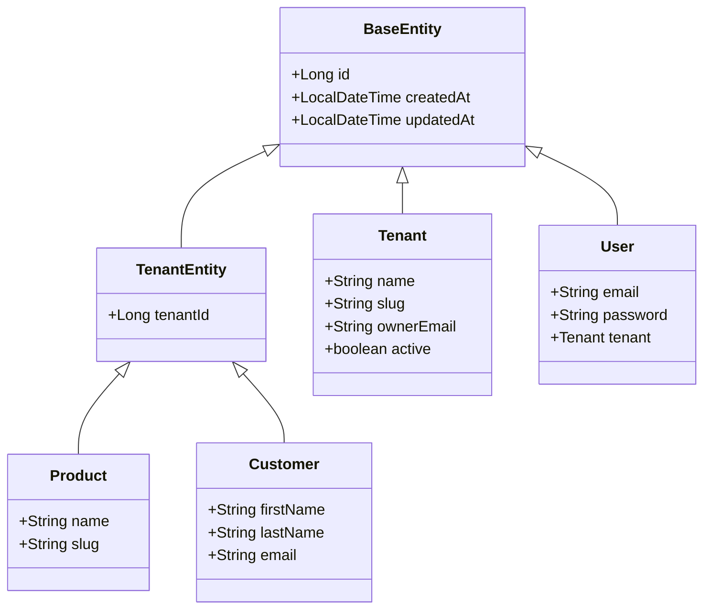

# Common Module Documentation

## 📝 Overview

The Common module provides shared base classes, utilities, and infrastructure used across all other modules. It is the foundation of the multi-tenancy architecture.

## 📁 Package Structure

```
com.firas.saas.common/
├── base/
│   ├── BaseEntity.java         # Base entity with id, createdAt, updatedAt
│   ├── BaseRepository.java     # Base repository interface
│   └── TenantEntity.java       # Base entity for tenant-scoped data
├── config/
│   └── AuditConfig.java        # JPA auditing configuration
├── context/
│   └── TenantContext.java      # Tenant context utility
├── exception/
│   └── GlobalExceptionHandler.java
├── response/
│   └── ApiResponse.java
└── util/
    └── (Utility classes)
```

## 🔑 Key Components

### BaseEntity

The root base class for all JPA entities.

```java
@MappedSuperclass
@EntityListeners(AuditingEntityListener.class)
public abstract class BaseEntity {
    @Id
    @GeneratedValue(strategy = GenerationType.IDENTITY)
    private Long id;

    @CreatedDate
    @Column(nullable = false, updatable = false)
    private LocalDateTime createdAt;

    @LastModifiedDate
    @Column(nullable = false)
    private LocalDateTime updatedAt;
}
```

### TenantEntity

Base class for all tenant-scoped entities. Extends `BaseEntity` and adds mandatory `tenant_id`.

```java
@MappedSuperclass
public abstract class TenantEntity extends BaseEntity {
    @Column(name = "tenant_id", nullable = false)
    private Long tenantId;
}
```

**Usage:**
```java
@Entity
public class Product extends TenantEntity {
    // tenantId is inherited
    private String name;
    private String slug;
}
```

### TenantContext

Utility class to access the current tenant from the security context.

```java
// Get current tenant ID (throws if not authenticated)
Long tenantId = TenantContext.getCurrentTenantId();

// Get tenant ID or null (safe for optional operations)
Long tenantId = TenantContext.getCurrentTenantIdOrNull();

// Check if tenant context exists
if (TenantContext.hasTenantContext()) {
    // Tenant-aware operation
}
```

**When to use:**
- In controllers to get the current user's tenant
- In services when tenant ID is not passed as parameter
- In scheduled jobs (check if context exists first)

### BaseRepository

Base repository interface that all repositories extend.

```java
@NoRepositoryBean
public interface BaseRepository<T extends BaseEntity> extends JpaRepository<T, Long> {
}
```

## 📐 Entity Inheritance Diagram



## 🔒 Tenant Isolation Rules

### Entities that extend TenantEntity:
- `Product`, `Category`, `ProductVariant`
- `Customer`
- `Order`, `OrderItem`, `Cart`, `CartItem`
- `Subscription`, `Invoice`, `Payment`

### Entities that extend BaseEntity directly:
- `Tenant` (IS the tenant)
- `User` (has JPA relationship to Tenant)
- `SubscriptionPlan` (global, shared across tenants)

## 🛠️ Adding New Tenant-Scoped Entities

1. **Create entity extending TenantEntity:**
```java
@Entity
@Table(name = "discounts")
public class Discount extends TenantEntity {
    private String code;
    private BigDecimal percentage;
}
```

2. **Create repository with tenant filtering:**
```java
@Repository
public interface DiscountRepository extends BaseRepository<Discount> {
    List<Discount> findAllByTenantId(Long tenantId);
    Optional<Discount> findByCodeAndTenantId(String code, Long tenantId);
}
```

3. **Service receives tenantId:**
```java
@Service
public class DiscountServiceImpl implements DiscountService {
    public DiscountResponse createDiscount(DiscountRequest request, Long tenantId) {
        Discount discount = Discount.builder()
            .code(request.getCode())
            .build();
        discount.setTenantId(tenantId);  // Set tenant ID
        return mapToResponse(repository.save(discount));
    }
}
```

4. **Controller uses TenantContext:**
```java
@RestController
@RequestMapping("/api/v1/discounts")
public class DiscountController {
    @PostMapping
    public ResponseEntity<DiscountResponse> createDiscount(@RequestBody DiscountRequest request) {
        Long tenantId = TenantContext.getCurrentTenantId();
        return ResponseEntity.ok(discountService.createDiscount(request, tenantId));
    }
}
```

## 📝 Last Updated

- **Date**: January 20, 2026

