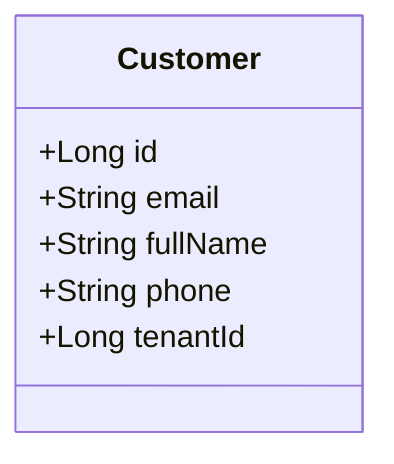

# Customer Module Documentation

## 📝 Overview
Manages CRM (Customer Relationship Management) data for Merchants. This is distinct from the **User** module.

- **User**: Authentication Identity.
- **Customer**: Business record (Orders, Address, Lifetime Value).

## 🔑 Key Entities

### Customer
- `firstName`, `lastName`
- `email`
- `phone`
- `tenantId`: The store this customer belongs to.

## 🔄 Relationship with User
Currently, they are separate. In a future iteration, a `User` (Shopper) will be linked to a `Customer` profile.

`User (Login)` --- 1:1 --- `Customer (Data)`
