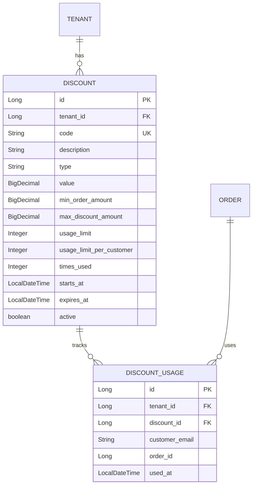
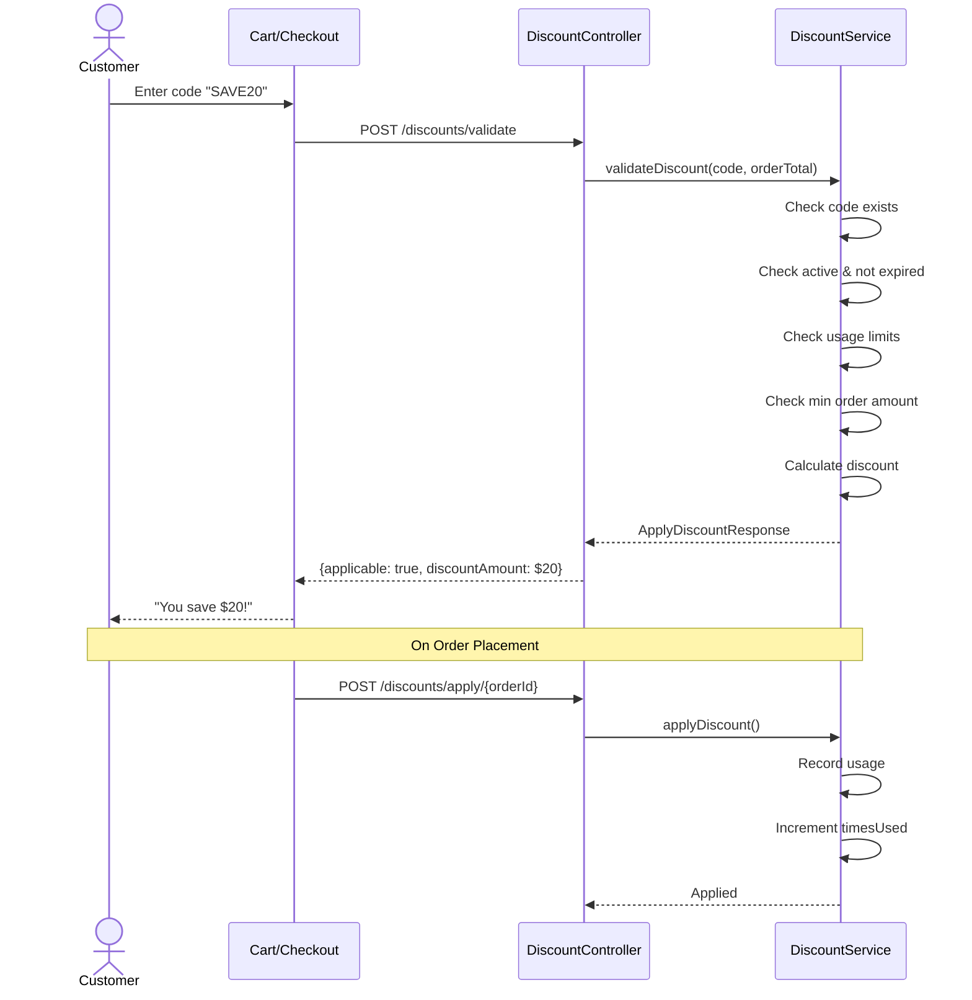

# Discount Module Documentation

## 📝 Overview

The Discount module provides coupon code management for merchants. Supports percentage and fixed-amount discounts with various constraints like usage limits, minimum order amounts, and expiration dates.

## 📁 Package Structure

```
com.firas.saas.discount/
├── entity/
│   ├── Discount.java          # Coupon/discount entity
│   └── DiscountUsage.java     # Usage tracking per customer
├── repository/
│   ├── DiscountRepository.java
│   └── DiscountUsageRepository.java
├── dto/
│   ├── DiscountRequest.java
│   ├── DiscountResponse.java
│   ├── ApplyDiscountRequest.java
│   └── ApplyDiscountResponse.java
├── service/
│   ├── DiscountService.java
│   └── DiscountServiceImpl.java
├── controller/
│   └── DiscountController.java
└── README.md
```

## 🔑 Key Entities

### Discount

Represents a coupon or discount code.

```java
@Entity
@Table(name = "discounts")
public class Discount extends TenantEntity {
    private String code;                    // "SAVE20", "SUMMER2026"
    private String description;
    private DiscountType type;              // PERCENTAGE or FIXED_AMOUNT
    private BigDecimal value;               // 20 (for 20%) or 10.00 (for $10)
    private BigDecimal minOrderAmount;      // Minimum order to apply
    private BigDecimal maxDiscountAmount;   // Cap for percentage discounts
    private Integer usageLimit;             // Total uses allowed
    private Integer usageLimitPerCustomer;  // Uses per customer
    private Integer timesUsed;              // Current usage count
    private LocalDateTime startsAt;
    private LocalDateTime expiresAt;
    private boolean active;
}
```

### DiscountType Enum

```java
public enum DiscountType {
    PERCENTAGE,   // e.g., 20% off
    FIXED_AMOUNT  // e.g., $10 off
}
```

### DiscountUsage

Tracks which customers have used which discounts.

```java
@Entity
@Table(name = "discount_usages")
public class DiscountUsage extends TenantEntity {
    private Discount discount;
    private String customerEmail;
    private Long orderId;
    private LocalDateTime usedAt;
}
```

## 📊 Database Schema



## 🔄 Discount Flow



## 📡 API Endpoints

| Method | Endpoint | Description |
|--------|----------|-------------|
| POST | `/api/v1/discounts` | Create discount |
| GET | `/api/v1/discounts` | List all discounts |
| GET | `/api/v1/discounts/active` | List active/valid discounts |
| GET | `/api/v1/discounts/{id}` | Get discount by ID |
| GET | `/api/v1/discounts/code/{code}` | Get discount by code |
| PUT | `/api/v1/discounts/{id}` | Update discount |
| DELETE | `/api/v1/discounts/{id}` | Delete discount |
| POST | `/api/v1/discounts/validate` | Validate discount for order |
| POST | `/api/v1/discounts/apply/{orderId}` | Apply discount to order |
| PATCH | `/api/v1/discounts/{id}/activate` | Activate discount |
| PATCH | `/api/v1/discounts/{id}/deactivate` | Deactivate discount |

## 💡 Usage Examples

### Create 20% Off Coupon
```json
POST /api/v1/discounts
{
  "code": "SAVE20",
  "description": "Save 20% on your order",
  "type": "PERCENTAGE",
  "value": 20,
  "minOrderAmount": 50.00,
  "maxDiscountAmount": 100.00,
  "usageLimit": 1000,
  "usageLimitPerCustomer": 1,
  "expiresAt": "2026-12-31T23:59:59"
}
```

### Create $10 Off Coupon
```json
POST /api/v1/discounts
{
  "code": "FLAT10",
  "description": "$10 off your order",
  "type": "FIXED_AMOUNT",
  "value": 10.00,
  "minOrderAmount": 30.00
}
```

### Validate Discount
```json
POST /api/v1/discounts/validate
{
  "code": "SAVE20",
  "orderTotal": 100.00,
  "customerEmail": "customer@example.com"
}

Response:
{
  "applicable": true,
  "code": "SAVE20",
  "message": "Discount applied successfully",
  "originalTotal": 100.00,
  "discountAmount": 20.00,
  "finalTotal": 80.00
}
```

## 🔒 Validation Rules

1. **Code Format**: Uppercase letters, numbers, hyphens, underscores only
2. **Percentage**: Must be between 0-100
3. **Expiration**: Discount auto-invalidates after `expiresAt`
4. **Usage Limits**: Global and per-customer limits enforced
5. **Minimum Order**: Discount only applies if order meets threshold

## 📝 Last Updated

- **Date**: January 20, 2026

