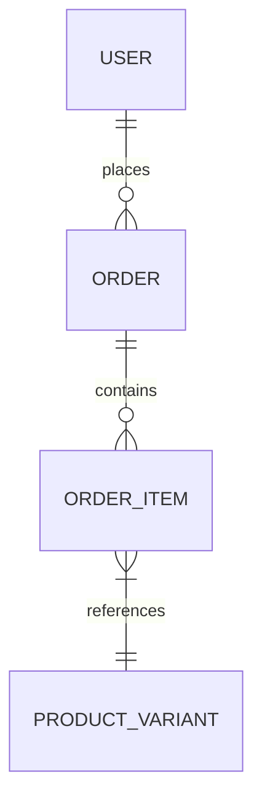
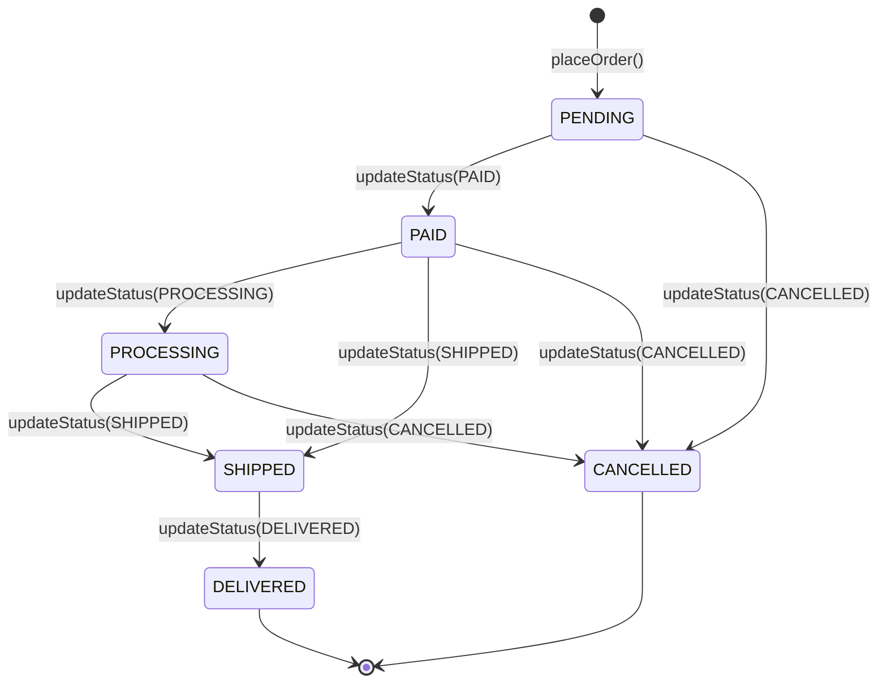

# Order Module Documentation

## 📝 Overview
Handles the checkout process, cart management, and order lifecycle.

## 🔑 Key Entities
- **Order**: Represents a completed purchase.
- **OrderItem**: Specific line items in an order (Product Variant + Quantity).
- **Cart**: Temporary holding area for items before purchase.
- **OrderStatus**: Order lifecycle states (PENDING, PROCESSING, SHIPPED, DELIVERED, CANCELLED)

## 🌐 API Endpoints

### Cart Management
| Method | Endpoint | Description | Auth |
|--------|----------|-------------|------|
| POST | `/api/v1/orders/cart/add` | Add item to cart | Customer |
| GET | `/api/v1/orders/cart` | Get current cart | Customer |
| DELETE | `/api/v1/orders/cart` | Clear cart | Customer |

### Order Management
| Method | Endpoint | Description | Auth |
|--------|----------|-------------|------|
| POST | `/api/v1/orders/checkout` | Place order from cart | Customer |
| GET | `/api/v1/orders` | Get all orders (tenant) | MERCHANT, STAFF |
| GET | `/api/v1/orders/my` | Get my orders | Customer |
| GET | `/api/v1/orders/{id}` | Get order by ID | Any |
| GET | `/api/v1/orders/number/{orderNumber}` | Get order by number | Any |
| PATCH | `/api/v1/orders/{id}/status?status=X` | Update order status | MERCHANT, STAFF |

## 🏗️ Order State Machine
The order lifecycle follows strict transition rules to ensure business integrity.

> [!WARNING]
> Transitions like `PENDING` → `DELIVERED` are rejected with `400 Bad Request` to prevent business logic flaws.

## 🔔 Webhook Events
The order module triggers the following events:
- `ORDER_CREATED`: When a new order is formally placed and inventory is deducted.
- `ORDER_UPDATED`: On any status change.
- `ORDER_PAID`: When payment is confirmed.
- `ORDER_FULFILLED`: When the order status is set to `DELIVERED`.
- `ORDER_CANCELLED`: When the order is cancelled.

## 🔒 Security
- Cart operations: Any authenticated user
- View all orders: MERCHANT, STAFF only
- Update order status: MERCHANT, STAFF only
- Tenant isolation enforced on all operations

