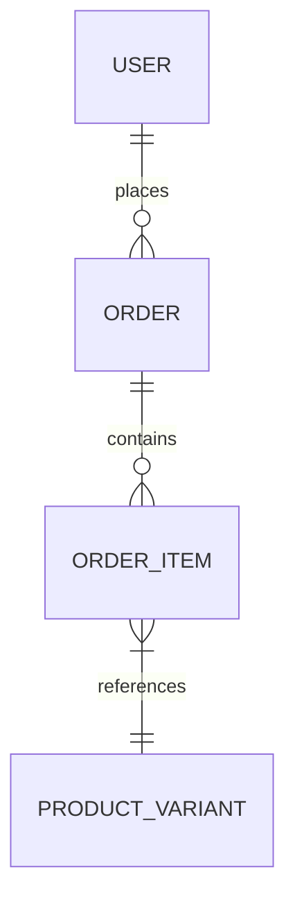
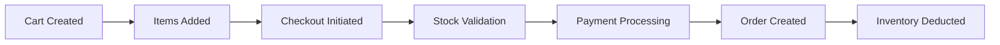

# Order Module Documentation

## 📝 Overview
Handles the checkout process, cart management, and order lifecycle.

## 🔑 Key Entities
- **Order**: Represents a completed purchase.
- **OrderItem**: Specific line items in an order (Product Variant + Quantity).
- **Cart**: Temporary holding area for items before purchase.

## 🔄 Checkout Flow (Simplified)

