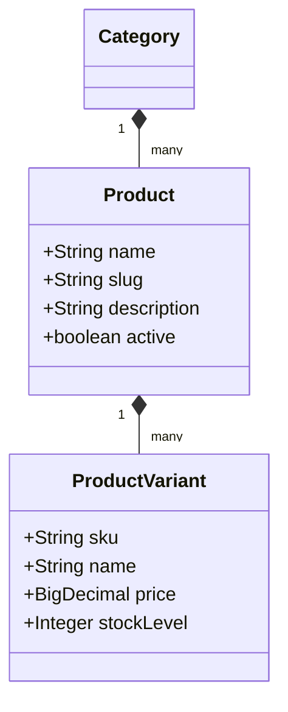

# Product Module Documentation

## 📝 Overview
Manages the catalog functionality: specific products, variants (size/color), and categories.

## 🔑 Key Entities
- **Category**: Hierarchical grouping of products.
- **Product**: main item entity.
- **ProductVariant**: Specific SKU (e.g., "Red Shirt Size L").

## 🔄 API Operations
- `GET /api/v1/products`: List products (Public/Authorized).
- `POST /api/v1/products`: Create product (Merchant).
- `DELETE /api/v1/products/{id}`: Soft delete product.
