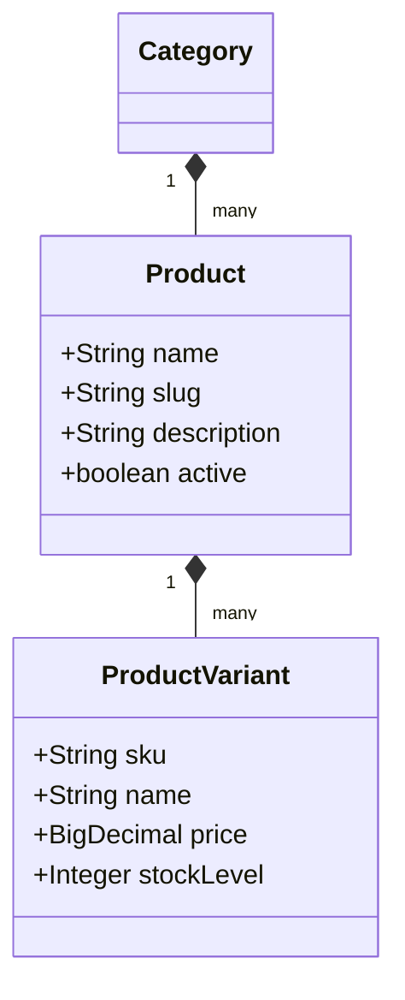
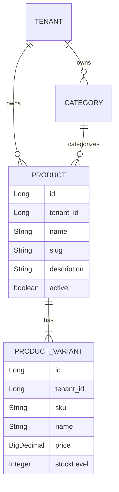

# Product Module Documentation

## 📝 Overview
Manages the catalog functionality: specific products, variants (size/color), and categories.

## 🔑 Key Entities
- **Category**: Hierarchical grouping of products.
- **Product**: main item entity.
- **ProductVariant**: Specific SKU (e.g., "Red Shirt Size L").

## 🏗️ Architecture & Database
All product data is scoped by `tenant_id` at the entity level via `TenantEntity`.

## 🔄 API Operations
- `GET /api/v1/products`: List products (Public/Authorized).
- `POST /api/v1/products`: Create product (Merchant).
- `GET /api/v1/products/{id}`: Get product details (Internal/Client).
- `PUT /api/v1/products/{id}`: Update product details (Merchant).
- `DELETE /api/v1/products/{id}`: Soft delete product (Merchant).

## 🔔 Webhook Events
The product module triggers the following events:
- `PRODUCT_CREATED`: When a new product and its variants are saved.
- `PRODUCT_UPDATED`: When product core details change.
- `PRODUCT_DELETED`: When a product is removed from the catalog.

> [!NOTE]
> All product events include the `tenant_id` and `tenant_slug` in the webhook payload for proper merchant isolation.
