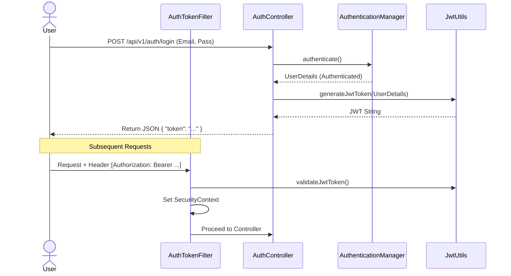

# Security Module Documentation

## 📝 Overview
Handles authentication (Login) and authorization (Role-based access). Uses JWT (JSON Web Tokens) for stateless security.

## 🔑 Key Components

- **JwtUtils**: Generates and validates JWT tokens.
- **UserDetailsServiceImpl**: Loads user data from the database.
- **AuthEntryPointJwt**: Handles 401 Unauthorized errors.
- **AuthTokenFilter**: Intercepts requests to validate the `Authorization: Bearer <token>` header.

## 🛡️ Authentication Flow

