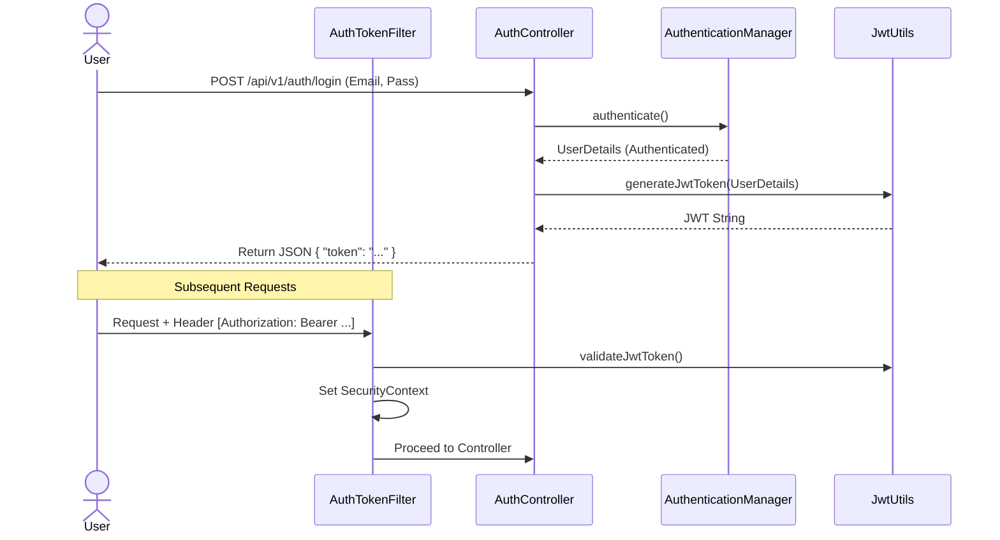
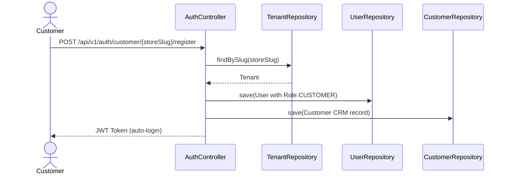

# Security Module Documentation

## 📝 Overview
Handles authentication (Login) and authorization (Role-based access). Uses JWT (JSON Web Tokens) for stateless security.

## 🔑 Key Components

- **JwtUtils**: Generates and validates JWT tokens.
- **UserDetailsServiceImpl**: Loads user data from the database.
- **AuthEntryPointJwt**: Handles 401 Unauthorized errors.
- **AuthTokenFilter**: Intercepts requests to validate the `Authorization: Bearer <token>` header.

## 🛡️ Authentication Flow



## 🔄 API Endpoints

| Method | Endpoint | Description | Auth |
|--------|----------|-------------|------|
| POST | `/api/v1/auth/register` | Register new merchant (creates Tenant + User) | Public |
| POST | `/api/v1/auth/login` | Login for any user | Public |
| POST | `/api/v1/auth/customer/{storeSlug}/register` | Customer self-registration on a store | Public |

## 👤 Customer Registration Flow (Added January 2026)

Customers can self-register on a specific store:



**Request Body:**
```json
{
  "email": "customer@example.com",
  "password": "password123",
  "firstName": "John",
  "lastName": "Doe",
  "phone": "555-1234"
}
```

**Response:** Returns JWT token for immediate login (201 Created).


