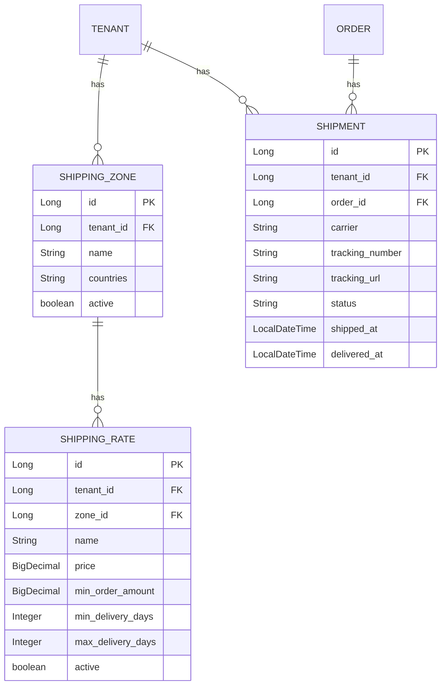
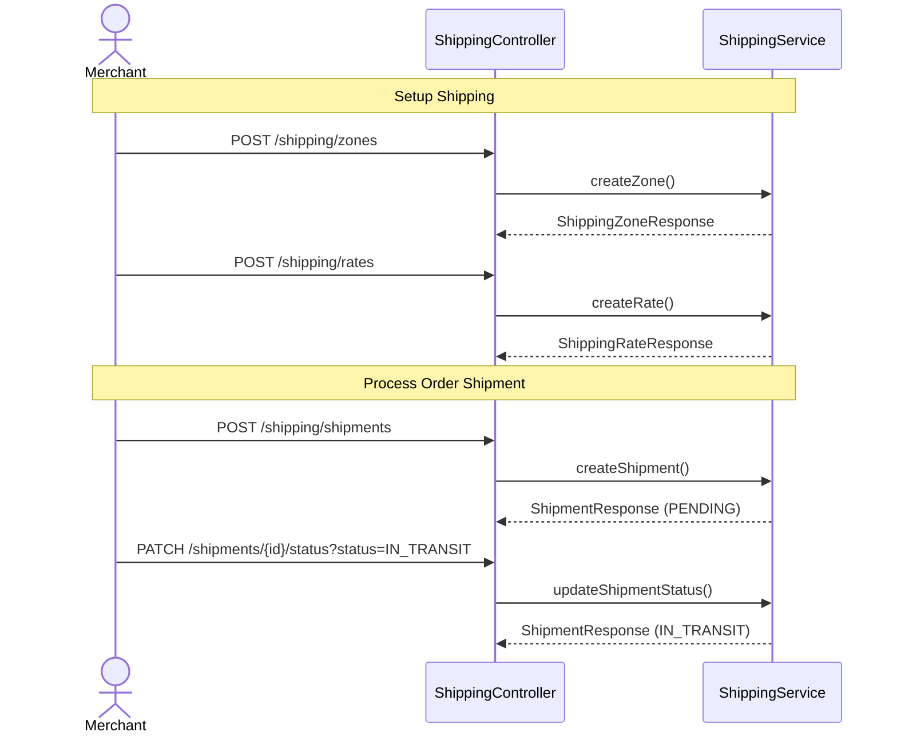

# Shipping Module Documentation

## 📝 Overview

The Shipping module manages shipping zones, rates, and shipment tracking for each tenant's store. All shipping data is tenant-scoped.

## 📁 Package Structure

```
com.firas.saas.shipping/
├── entity/
│   ├── ShippingZone.java      # Geographic shipping zones
│   ├── ShippingRate.java      # Rate configurations per zone
│   └── Shipment.java          # Order shipment tracking
├── repository/
│   ├── ShippingZoneRepository.java
│   ├── ShippingRateRepository.java
│   └── ShipmentRepository.java
├── dto/
│   ├── ShippingZoneRequest.java
│   ├── ShippingZoneResponse.java
│   ├── ShippingRateRequest.java
│   ├── ShippingRateResponse.java
│   ├── ShipmentRequest.java
│   └── ShipmentResponse.java
├── service/
│   ├── ShippingService.java
│   └── ShippingServiceImpl.java
├── controller/
│   └── ShippingController.java
└── README.md
```

## 🔑 Key Entities

### ShippingZone

Represents a geographic shipping zone (e.g., "Domestic", "Europe", "International").

```java
@Entity
@Table(name = "shipping_zones")
public class ShippingZone extends TenantEntity {
    private String name;        // Zone name
    private String countries;   // Comma-separated country codes
    private boolean active;
}
```

### ShippingRate

Represents a shipping rate within a zone.

```java
@Entity
@Table(name = "shipping_rates")
public class ShippingRate extends TenantEntity {
    private ShippingZone zone;
    private String name;            // e.g., "Standard", "Express"
    private BigDecimal price;
    private BigDecimal minOrderAmount;  // Free shipping threshold
    private Integer minDeliveryDays;
    private Integer maxDeliveryDays;
    private boolean active;
}
```

### Shipment

Tracks order shipments with carrier information.

```java
@Entity
@Table(name = "shipments")
public class Shipment extends TenantEntity {
    private Long orderId;
    private String carrier;         // "UPS", "FedEx", etc.
    private String trackingNumber;
    private String trackingUrl;
    private ShipmentStatus status;
    private LocalDateTime shippedAt;
    private LocalDateTime deliveredAt;
}
```

### ShipmentStatus Enum

```java
public enum ShipmentStatus {
    PENDING,
    LABEL_CREATED,
    PICKED_UP,
    IN_TRANSIT,
    OUT_FOR_DELIVERY,
    DELIVERED,
    FAILED,
    RETURNED
}
```

## 📊 Database Schema



## 🔄 Shipping Flow



## 📡 API Endpoints

### Shipping Zones

| Method | Endpoint | Description |
|--------|----------|-------------|
| POST | `/api/v1/shipping/zones` | Create shipping zone |
| GET | `/api/v1/shipping/zones` | List all zones |
| GET | `/api/v1/shipping/zones/{id}` | Get zone by ID |
| PUT | `/api/v1/shipping/zones/{id}` | Update zone |
| DELETE | `/api/v1/shipping/zones/{id}` | Delete zone |

### Shipping Rates

| Method | Endpoint | Description |
|--------|----------|-------------|
| POST | `/api/v1/shipping/rates` | Create shipping rate |
| GET | `/api/v1/shipping/rates` | List all rates |
| GET | `/api/v1/shipping/zones/{zoneId}/rates` | Get rates by zone |
| GET | `/api/v1/shipping/rates/{id}` | Get rate by ID |
| PUT | `/api/v1/shipping/rates/{id}` | Update rate |
| DELETE | `/api/v1/shipping/rates/{id}` | Delete rate |

### Shipments

| Method | Endpoint | Description |
|--------|----------|-------------|
| POST | `/api/v1/shipping/shipments` | Create shipment |
| GET | `/api/v1/shipping/orders/{orderId}/shipments` | Get shipments by order |
| GET | `/api/v1/shipping/shipments/{id}` | Get shipment by ID |
| PATCH | `/api/v1/shipping/shipments/{id}/status` | Update shipment status |
| GET | `/api/v1/shipping/shipments/track/{trackingNumber}` | Track by tracking number |

## 🔒 Tenant Isolation

All entities extend `TenantEntity`:
- Every query filters by `tenantId`
- Cross-tenant access is prevented at service layer
- Controller uses `TenantContext.getCurrentTenantId()`

## 📝 Last Updated

- **Date**: January 20, 2026

