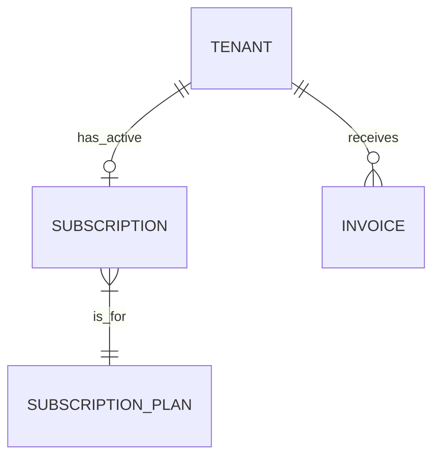
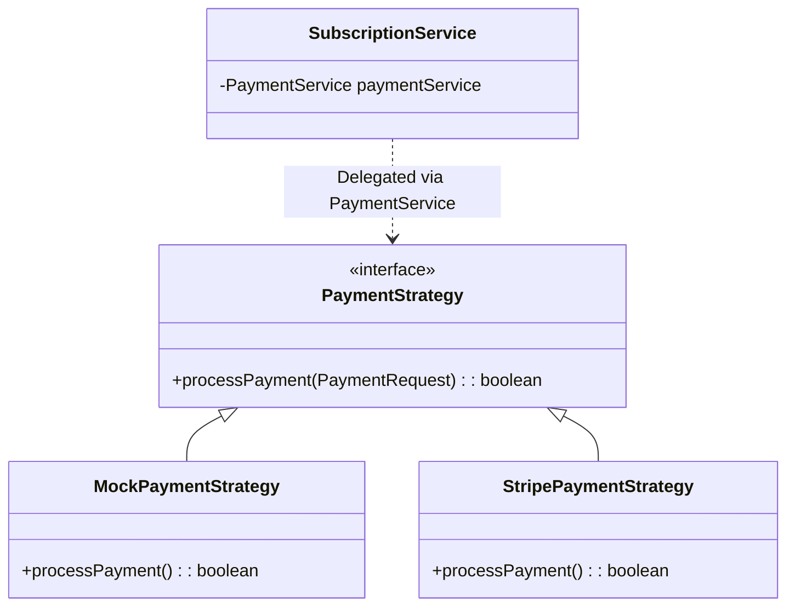

# Subscription & Billing Module

## 📝 Overview
Manages platform revenue. Allows Admins to define Plans and Merchants to subscribe to them. Handles payment processing via Strategy Pattern.

## 🔑 Key Entities

- **SubscriptionPlan**: The product being sold (e.g., "Pro Plan").
- **Subscription**: The relationship between a Tenant and a Plan.
- **Invoice**: Record of payment.

## 💸 Billing Strategy Pattern
The module uses the Strategy Pattern to support multiple payment gateways.

## 🔄 Subscription Flow
1. **Admin** creates Plan (`POST /plans`).
2. **Merchant** selects Plan (`POST /subscribe`).
3. **PaymentService** processes payment (MOCK/STRIPE).
4. If Success:
   - **Subscription** created/updated.
   - **Invoice** generated (`PAID`).
