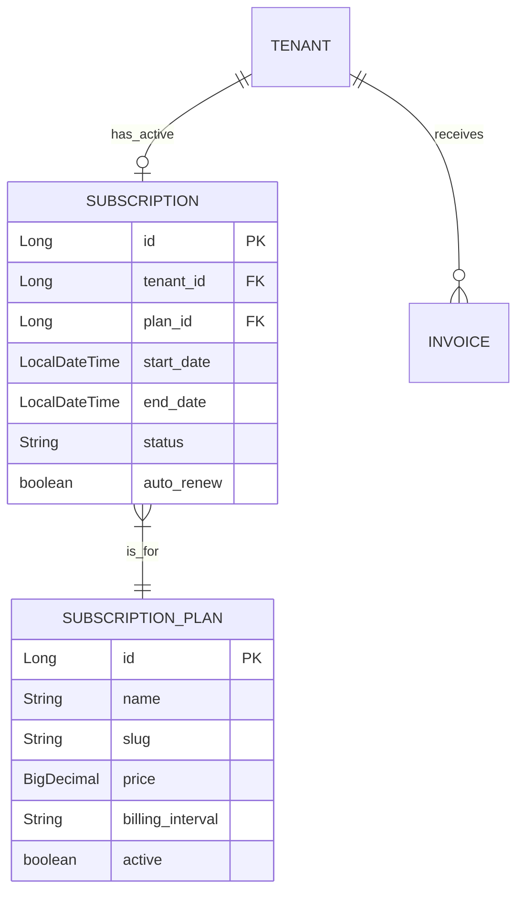
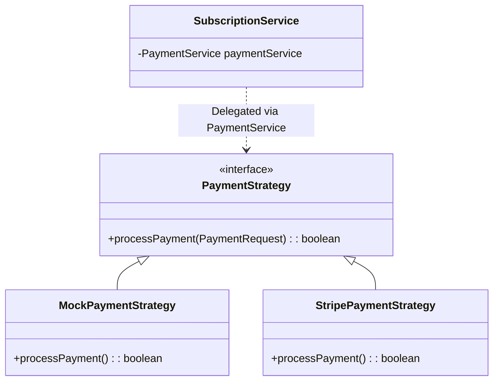
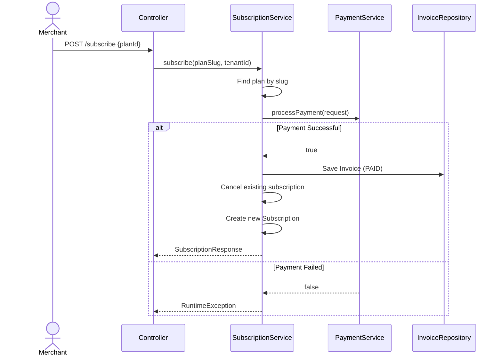

# Subscription Module

## 📝 Overview
Manages platform revenue. Allows Admins to define Plans and Merchants to subscribe to them. Handles payment processing via Strategy Pattern.

## 📁 Package Structure

```
com.firas.saas.subscription/
├── entity/
│   ├── SubscriptionPlan.java    # Global plan definitions
│   ├── Subscription.java        # Tenant-scoped subscriptions
│   └── SubscriptionStatus.java  # Status enum
├── repository/
│   ├── SubscriptionPlanRepository.java
│   └── SubscriptionRepository.java
├── dto/
│   └── (Request/Response DTOs)
├── service/
│   ├── SubscriptionService.java
│   └── SubscriptionServiceImpl.java
└── controller/
    └── SubscriptionController.java
```

## 🔑 Key Entities

### SubscriptionPlan (GLOBAL)

**Note**: This is one of the few entities that is NOT tenant-scoped. Plans are shared across all tenants.

```java
@Entity
@Table(name = "subscription_plans")
public class SubscriptionPlan extends BaseEntity {
    // NO tenant_id - this is global
    private String name;           // "Basic", "Pro", "Enterprise"
    private String slug;
    private BigDecimal price;
    private String billingInterval; // "MONTHLY", "YEARLY"
    private String features;        // JSON or comma-separated
    private boolean active;
}
```

### Subscription (TENANT-SCOPED)

```java
@Entity
@Table(name = "subscriptions")
public class Subscription extends TenantEntity {
    // tenantId inherited from TenantEntity
    
    @ManyToOne
    private SubscriptionPlan plan;
    private LocalDateTime startDate;
    private LocalDateTime endDate;
    private SubscriptionStatus status;  // ACTIVE, CANCELED, EXPIRED
    private boolean autoRenew;
}
```

### SubscriptionStatus Enum

```java
public enum SubscriptionStatus {
    ACTIVE,
    CANCELED,
    EXPIRED,
    PENDING
}
```

## 📊 Database Schema



## 💸 Billing Strategy Pattern
The module uses the Strategy Pattern to support multiple payment gateways.



## 🔄 Subscription Flow



## 🔒 Tenant Isolation

- **SubscriptionPlan**: Global (no tenant_id) - Plans are shared
- **Subscription**: Tenant-scoped (extends `TenantEntity`)
- **Invoice**: Tenant-scoped (extends `TenantEntity`)

### Creating a Subscription

```java
Subscription subscription = Subscription.builder()
    .plan(plan)
    .startDate(LocalDateTime.now())
    .endDate(LocalDateTime.now().plusMonths(1))
    .status(SubscriptionStatus.ACTIVE)
    .autoRenew(true)
    .build();
subscription.setTenantId(tenantId);  // Set tenant ID via setter
subscriptionRepository.save(subscription);
```

## 📝 Last Updated

- **Date**: January 20, 2026
