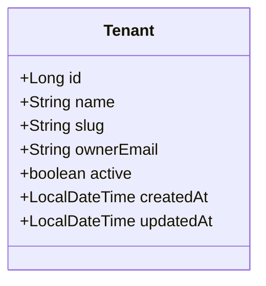
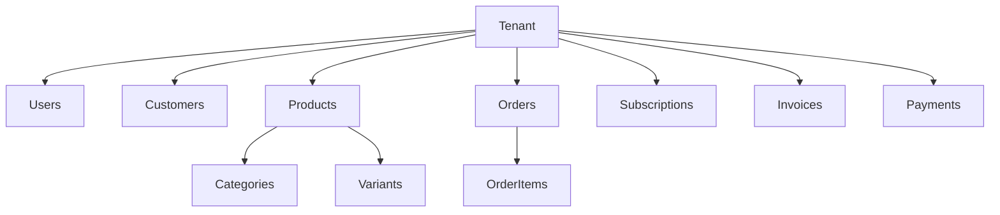
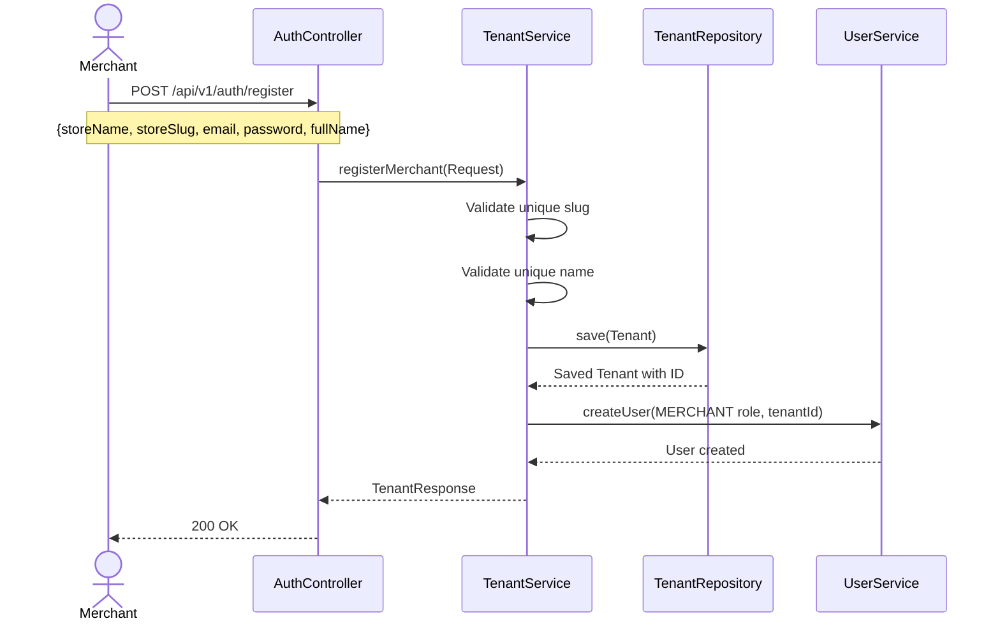

# Tenant Module Documentation

## 📝 Overview

The Tenant module is the **heart of the multi-tenancy architecture**. It handles the onboarding of new merchants (creating "Stores") and serves as the root aggregate for all business data.

> **Important**: Every business entity in this system belongs to a Tenant. The Tenant is the foundation of data isolation.

## 📁 Package Structure

```
com.firas.saas.tenant/
├── entity/
│   └── Tenant.java
├── repository/
│   └── TenantRepository.java
├── dto/
│   ├── TenantCreateRequest.java
│   └── TenantResponse.java
├── service/
│   ├── TenantService.java
│   └── TenantServiceImpl.java
├── controller/
│   └── TenantController.java
└── exception/
    └── TenantNotFoundException.java
```

## 🔑 Key Entities

### Tenant

Represents a Merchant's Store. This is the root entity of the domain.

```java
@Entity
@Table(name = "tenants")
public class Tenant extends BaseEntity {
    private String name;        // Display name of the store
    private String slug;        // Unique URL identifier (e.g., "my-store")
    private String ownerEmail;  // Email of the merchant owner
    private boolean active;     // Store status
}
```



## 🏛️ Tenant as Root Aggregate

All business entities reference the Tenant:



### Entities Owned by Tenant

| Entity | Relationship |
|--------|--------------|
| User | `@ManyToOne Tenant tenant` |
| Customer | `extends TenantEntity` |
| Product | `extends TenantEntity` |
| Category | `extends TenantEntity` |
| ProductVariant | `extends TenantEntity` |
| Order | `extends TenantEntity` |
| Cart | `extends TenantEntity` |
| Subscription | `extends TenantEntity` |
| Invoice | `extends TenantEntity` |
| Payment | `extends TenantEntity` |

## 🔄 Onboarding Flow

The following sequence describes how a new merchant is registered.



## 🔒 Tenant Isolation

The Tenant module ensures data isolation through:

1. **Unique Constraints**: `slug` and `name` are unique across all tenants
2. **Ownership**: All Users have a mandatory `tenant_id` foreign key
3. **Cascade**: Deleting a tenant should cascade to all owned entities

## 📡 API Endpoints

| Method | Endpoint | Description |
|--------|----------|-------------|
| POST | `/api/v1/auth/register` | Create new tenant + merchant user |
| GET | `/api/v1/tenants/{slug}` | Get tenant by slug |
| GET | `/api/v1/tenants` | List all tenants (admin only) |

## 📝 Last Updated

- **Date**: January 20, 2026

