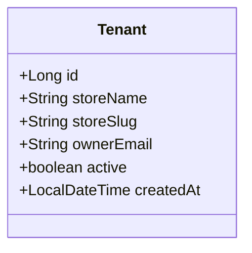
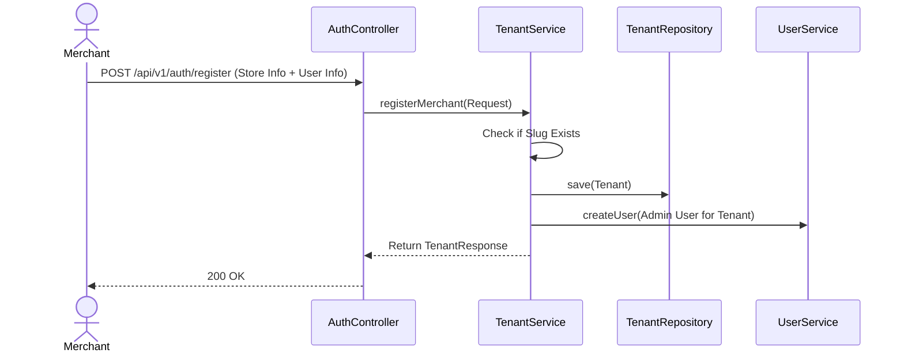

# Tenant Module Documentation

## 📝 Overview
The Tenant module is the heart of the multi-tenancy architecture. It handles the onboarding of new merchants (creating "Stores").

## 🔑 Key Entities

### Tenant
Represents a Merchant's Store.
- `id`: Primary Key
- `storeName`: Display name of the store.
- `storeSlug`: Unique URL identifier (e.g., `store-xyz`).
- `ownerEmail`: Email of the merchant owner.

## 🔄 Onboarding Flow
The following sequence describes how a new merchant is registered.

