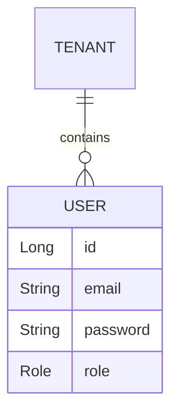
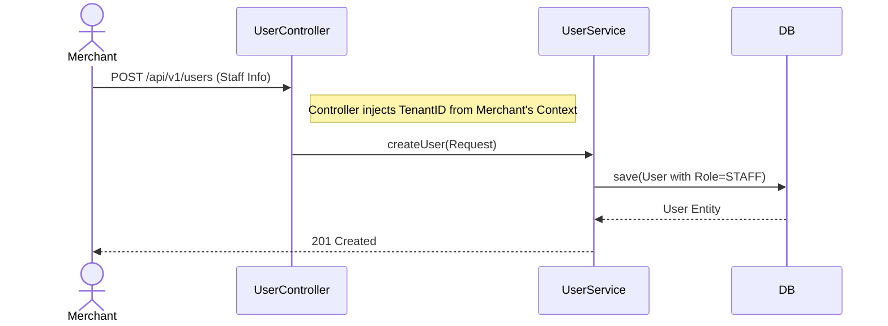

# User Module Documentation

## 📝 Overview
Manages all users in the system. Users are scoped to a specific `Tenant` (except System Admins who might manage the platform).

## 🔑 Key Entities

### User
- `email`: Login Identifier.
- `password`: BCrypt hashed.
- `role`: Enum (`ADMIN`, `MERCHANT`, `STAFF`, `CUSTOMER`).
- `tenant`: Reference to the Tenant (Store).

## ⚙️ Role Hierarchy
- **ADMIN**: System Administrator (Can manage plans).
- **MERCHANT**: Owner of a Tenant (Can manage staff, products, settings).
- **STAFF**: Employee of a Tenant (Limited access).
- **CUSTOMER**: Shopper account (Can view orders).

## 🔄 Staff Creation Flow (Merchant -> Staff)

