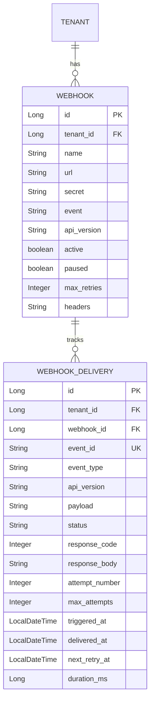
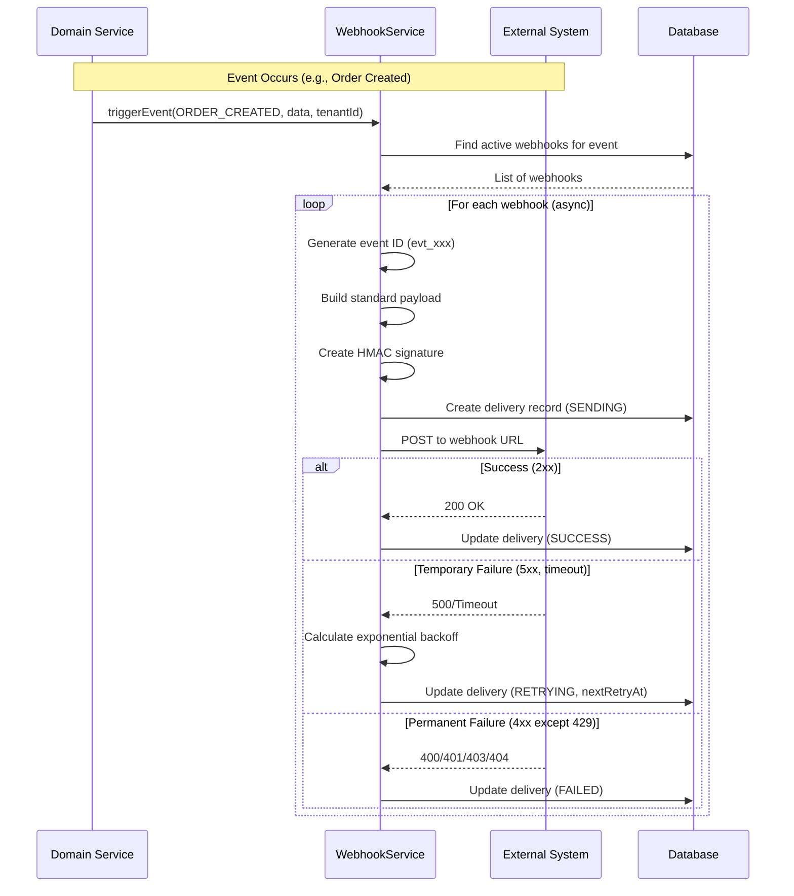

# Webhook Module Documentation

## 📝 Overview

The Webhook module enables external systems to receive real-time event notifications when actions occur in a merchant's store. The system is event-driven, reliable, secure, and tenant-isolated.

## 📁 Package Structure

```
com.firas.saas.webhook/
├── entity/
│   ├── Webhook.java             # Webhook subscription configuration
│   └── WebhookDelivery.java     # Delivery attempt tracking
├── repository/
│   ├── WebhookRepository.java
│   └── WebhookDeliveryRepository.java
├── dto/
│   ├── WebhookRequest.java
│   ├── WebhookResponse.java
│   ├── WebhookDeliveryResponse.java
│   └── WebhookEventPayload.java # Standard event payload structure
├── service/
│   ├── WebhookService.java
│   └── WebhookServiceImpl.java
├── controller/
│   └── WebhookController.java
└── README.md
```

## 🔑 Key Features

### Event Categories

| Category | Events |
|----------|--------|
| **Store** | `STORE_CREATED`, `STORE_UPDATED`, `STORE_DELETED` |
| **Products** | `PRODUCT_CREATED`, `PRODUCT_UPDATED`, `PRODUCT_DELETED` |
| **Inventory** | `INVENTORY_UPDATED`, `INVENTORY_LOW` |
| **Orders** | `ORDER_CREATED`, `ORDER_UPDATED`, `ORDER_PAID`, `ORDER_FULFILLED`, `ORDER_CANCELLED` |
| **Customers** | `CUSTOMER_CREATED`, `CUSTOMER_UPDATED` |
| **Payments** | `PAYMENT_SUCCEEDED`, `PAYMENT_FAILED`, `REFUND_CREATED` |
| **Apps** | `APP_INSTALLED`, `APP_UNINSTALLED` |
| **Subscriptions** | `SUBSCRIPTION_CREATED`, `SUBSCRIPTION_CANCELLED`, `SUBSCRIPTION_RENEWED` |

### Standard Payload Structure

Every webhook request follows this schema:

```json
{
  "id": "evt_abc123def456",
  "type": "order.created",
  "apiVersion": "v1",
  "createdAt": "2026-01-20T12:45:30Z",
  "tenant": {
    "id": "store_456",
    "slug": "my-store"
  },
  "data": {
    // Event-specific payload
  }
}
```

### Security Headers

Every webhook request includes:

```http
X-Webhook-Signature: sha256=abc123...
X-Webhook-Event: order.created
X-Webhook-Timestamp: 1737377130
X-Webhook-Id: evt_abc123def456
```

### Signature Verification

The signature is computed as:
```
HMAC-SHA256(timestamp + "." + payload, secret)
```

**Verification Example:**
```java
public boolean verifySignature(String payload, String timestamp, 
                               String signature, String secret) {
    String signaturePayload = timestamp + "." + payload;
    String expected = "sha256=" + HmacUtils.hmacSha256Hex(secret, signaturePayload);
    return MessageDigest.isEqual(expected.getBytes(), signature.getBytes());
}
```

## 📊 Database Schema



## 🔄 Delivery Flow



## 📡 API Endpoints

### Subscription Management

| Method | Endpoint | Description | Role |
|--------|----------|-------------|------|
| POST | `/api/v1/webhooks` | Create webhook | MERCHANT |
| GET | `/api/v1/webhooks` | List all webhooks | MERCHANT, STAFF |
| GET | `/api/v1/webhooks/{id}` | Get webhook by ID | MERCHANT, STAFF |
| PUT | `/api/v1/webhooks/{id}` | Update webhook | MERCHANT |
| DELETE | `/api/v1/webhooks/{id}` | Delete webhook | MERCHANT |
| PATCH | `/api/v1/webhooks/{id}/pause` | Pause webhook | MERCHANT |
| PATCH | `/api/v1/webhooks/{id}/resume` | Resume webhook | MERCHANT |
| POST | `/api/v1/webhooks/{id}/regenerate-secret` | New secret | MERCHANT |

### Delivery Management

| Method | Endpoint | Description | Role |
|--------|----------|-------------|------|
| GET | `/api/v1/webhooks/{id}/deliveries` | Delivery history | MERCHANT, STAFF |
| GET | `/api/v1/webhooks/deliveries/recent` | Recent deliveries | MERCHANT, STAFF |
| GET | `/api/v1/webhooks/deliveries/{id}` | Delivery by ID | MERCHANT, STAFF |
| GET | `/api/v1/webhooks/deliveries/event/{eventId}` | By event ID | MERCHANT, STAFF |
| POST | `/api/v1/webhooks/deliveries/{id}/retry` | Manual retry | MERCHANT |

### Testing & Events

| Method | Endpoint | Description | Role |
|--------|----------|-------------|------|
| POST | `/api/v1/webhooks/{id}/test` | Send test webhook | MERCHANT |
| GET | `/api/v1/webhooks/events` | List available events | MERCHANT, STAFF |

## 💡 Usage Examples

### Create Webhook
```json
POST /api/v1/webhooks
{
  "name": "Order Notifications",
  "url": "https://myapp.com/webhooks/orders",
  "event": "ORDER_CREATED",
  "apiVersion": "v1",
  "maxRetries": 5,
  "active": true
}
```

### Triggering Webhooks from Domain Services

**Recommended: Observer Pattern (Decoupled)**

```java
@Service
@RequiredArgsConstructor
public class OrderServiceImpl implements OrderService {
    
    private final DomainEventPublisher eventPublisher; // Observer pattern
    
    @Override
    public OrderResponse createOrder(OrderRequest request, Long tenantId) {
        Order order = // create order
        
        // Publish domain event - listeners handle webhook delivery
        eventPublisher.publish(
            WebhookEvent.ORDER_CREATED,
            Map.of(
                "orderId", order.getId(),
                "orderNumber", order.getOrderNumber(),
                "totalPrice", order.getTotalPrice(),
                "status", order.getStatus()
            ),
            tenantId,
            tenant.getSlug()
        );
        
        return mapToResponse(order);
    }
}
```

**Event Listener (handles webhook delivery):**

```java
@Component
@RequiredArgsConstructor
public class WebhookEventListener {
    
    private final WebhookService webhookService;
    
    @EventListener
    @Async
    public void handleDomainEvent(DomainEvent event) {
        webhookService.triggerEvent(
            event.getEventType(),
            event.getData(),
            event.getTenantId(),
            event.getTenantSlug()
        );
    }
}
```

**Benefits of Observer Pattern:**
- Services are decoupled from webhook system
- Easy to add new listeners (email, analytics) without modifying services
- Async handling via `@Async` annotation
- Testable - verify events were published

**Legacy: Direct Call (Still Supported)**

```java
// Direct call - works but creates tight coupling
webhookService.triggerEvent(WebhookEvent.ORDER_CREATED, data, tenantId, tenantSlug);
```

## 🔒 Security & Isolation

### HTTPS Only
- All webhook URLs must use HTTPS
- HTTP URLs are rejected at validation

### Tenant Isolation
- Events belong to exactly one tenant
- Webhooks only receive their tenant's data
- No cross-tenant event leakage

### Idempotency
- Each event has a globally unique ID (`evt_xxx`)
- Same event is never regenerated with a new ID
- Consumers can safely retry processing

## ⚡ Retry Strategy

| Attempt | Delay | Total Time |
|---------|-------|------------|
| 1 | Immediate | 0 min |
| 2 | 2 min | 2 min |
| 3 | 4 min | 6 min |
| 4 | 8 min | 14 min |
| 5 | 16 min | 30 min |

**Retry Rules:**
- Retry on: Network failure, 5xx responses, 429 (Too Many Requests)
- Stop on: 2xx success, 4xx permanent failure (except 429)
- Maximum retry window: Configurable per webhook (default 5 attempts)

## 📊 Delivery Statuses

| Status | Description |
|--------|-------------|
| `PENDING` | Queued for delivery |
| `SENDING` | Currently being sent |
| `SUCCESS` | Delivered successfully (2xx) |
| `FAILED` | Permanently failed (4xx) |
| `RETRYING` | Scheduled for retry |
| `EXHAUSTED` | All retries exhausted |

## 📝 Last Updated

- **Date**: January 20, 2026
- **Version**: 1.0
- **Specification Compliance**: Full
